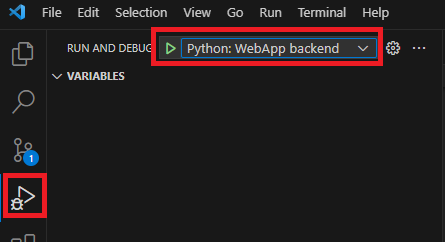
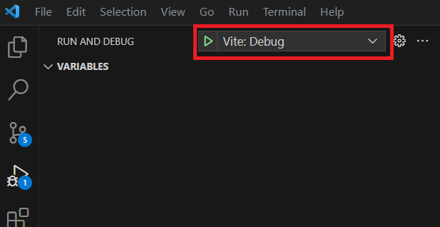

# Debugging the Information Assistant Web App in VS Code

If you wish to debug the user interface, or web app that as part of this accelerator, you can do this locally in VS Code and step through the logic. 

The app consists of two layers, namely the frontend user interface components and the backend logic components. As a user interacts with the user interface, they are engaging with the frontend code, and control is passed to the back end code as needed, for example to make calls to the Azure OpenAI service.

To debug the webapp, both frontend and backend, first set breakpoints in your code under the frontend and/or backend. Select the 'Run & Debug' tab from the sidebar in VS Code. Select Python: Flask from the dropdown and hit run. This will initiate local debugging of the backend code.

Next, you will need to initiate debugging of the frontend code. To do this select 'Vite: Debug' from the drop down and hit run.

This will initiate frontend running and debugging. a browser will open and show the web app running under localhost:5000. Next proceed to interact with the web app, by asking a question. In the VS Code interface, you code will hit the breakpoints, frontend or backend, and you will be able to view variable, trace logic etc. You can switch between the two running debuggers by selecting frontend or backend  (flask or vite) from the debug dropdown.

## Known Issues

### Slow response

In testing we have found that interacting with the webapp through the browser is very slow after initiating debugging. We have found double clicks on buttons seems to trigger actions. After a few minutes, performance improves to an acceptable level.
